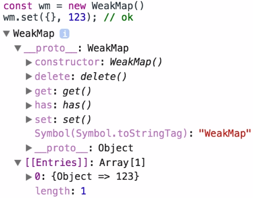

# 6-2. WeakMap
새로운 데이터 구조인 Map객체에 이어 WeakMap이란? <br>
>`WeakMap`객체는  `object`만을 키로 허용하고 값은 임의의 값을 허용하는  키/값 형태의 요소의 집합이다. 
<br>

## 6-2-1. syntax
`Map`은 key에 오는 타입에 대한 제약이 없으나 `WeakMap`은 `object`만을 key로 가진다. <br>
Map과 동일하게 WeakMap 객체의 생성은 `new`연산자를 통해서 객체를 생성한다. iterable 객체를 파라미터로 가지는 것도 동일하다.

```js
new WeakMap([iterable])
```
크롬 브라우저에서의 `WeakMap` 출력 결과의 모습<br>

<br>

## 6-2-2. WeakMap의 키는 객체
`WeakMap`에 엔트리를 추가할 때, 그 엔트리의 **키는 반드시 객체**여야 한다.<br>
허나 값은 임의의 값이 될 수 있다. 

```js
const wm = new WeakMap()

wm.set('abc', 123); // TypeError
wm.set({}, 123); // ok
```
<br>

## 6-2-3. WeakMap의 키는 약하게 연결되어 있다.
`WeakMap`의 키 타입인 객체에 대한 참조는 약한 참조이다. 
이게 뜻 하는 의미는 키가 가지고 있는 객체에 대한 참조가 더이상 존재하지 않을 경우 **garbage collection(GC)** 의 수거 대상이 된다라는 것.<br>

보통 어떠한 저장장소(변수, 프로퍼티 등)에서도 언급되지 않는 객체는 가비지 컬렉션의 대상이 될 수 있다. 이런 맥락에서 위크맵의 키는 저장장소로 간주되지 않는다. 같은 의미로 WeakMap 은 자신의 파라미터 `key` 들에 대한 레퍼런스를 보관하지 않는다. `key` 가 살아 있을 경우에만 관련 `value` 가 유지된다. `WeakSet`도 비슷하다. <br> 
다시 말하면 위크맵의 키로 할당된 객체는 가비지 컬렉션에 수집되는 것을 막지 않는다. 하지만 ES6 의 위크-컬렉션은 스크립트에게 GC 실행 사실을 노출하지 않고서도 메모리를 관리할 수 있는 장점이 있다.

***이해를 위한 참고 URL>***<br>
자바스크립트에서 가비지 컬렉션<br>
[http://codingnuri.com/javascript-tutorial/javascript-garbage-collection.html](http://codingnuri.com/javascript-tutorial/javascript-garbage-collection.html)
<br>

자바의 reference와 가비지 컬렉션<br>
[http://d2.naver.com/helloworld/329631](http://d2.naver.com/helloworld/329631)<br>

**왜 이런 제약을 용인한 걸까? 왜 그냥 JS 에 위크-레퍼런스(weak reference)를 추가하지 않은 걸까? **<br>
ES6 의 위크-컬렉션은 비교적 제한된 기능만 가지고 있지만, 각각의 플랫폼마다 제각각인 GC의 행동양식에 대한 의존성을 줄이고 GC 실행의 예측 불가능성 숨기기 위함. <br>
[http://hacks.mozilla.or.kr/2015/12/es6-in-depth-collections/](http://hacks.mozilla.or.kr/2015/12/es6-in-depth-collections/)

<br>
## 6-2-4. WeakMap의 내용 전체를 살펴보거나 일괄 삭제 불가.
즉, 언제든지 오브젝트가 GC의 대상이 될수 있기 때문에 `WeakMap`은 키 들은 열거불가하다. (키 목록을 제공하는 메서드가 없음 ) 키 목록을 원하는 경우, `Map`을 사용해야 한다.<br>
`WeakMap`의 `key`에 대해 순회하는게 불가능할 뿐만 아니라 값과 엔트리에 대한 순회도 마찬가지로 이터레이트하는 것이 불가능하여 내용 전체를 살펴 볼 수 없다. 각 키들이 약하게 연결된 상태를 유지할 것이 보장되어야 하기 때문이다.<br>
2가지 위크-컬렉션(weak collection)이 모두 이터러블(iterable)이 아니다. 필요한 엔트리를 분명하게 명시하지 않으면 위크-컬렉션 안의 엔트리를 얻을 수 없다. 필요한 엔트리를 얻으려면 필요한 `key` 를 전달해야 한다.
이러한 제한은 보안 프로퍼티를 가능케 한다. <br>
>"위크맵의 키와 값 쌍에 대한 매핑은 오직 해당 위크맵과 키 모두를 알고 있는 경우에만 관찰하거나 영향을 미칠 수 있다. 위크맵만을 아는 경우에는 clear()로만 위크맵의 키 값 쌍의 매핑에 영향을 줄 수 있다."


## 6-2-5. API
```js
WeakMap.prototype.get(key) : any
WeakMap.prototype.set(key, value) : this
WeakMap.prototype.has(key) : boolean
WeakMap.prototype.delete(key) : boolean
```
**WeakMap.prototype.get(key)<br>**
>key와 관련된 값을 	반환 또는 관련 값이 없는 경우 `undefined`를 반환합니다.

**WeakMap.prototype.set(key, value)**<br>
>WeakMap 객체 내 key에 대해 값을 설정합니다. `WeakMap` 객체를 반환합니다.

**WeakMap.prototype.delete(key)**<br>
>key와 관련된 모든 값을 제거합니다. WeakMap.prototype.has(key)는 그 뒤에 `false`를 반환합니다.

**WeakMap.prototype.has(key)**<br>
>WeakMap 객체 내 key와 관련된 값이 있는지 여부를 나타내는 `boolean`을 반환합니다.
<br>


```js
var wm1 = new WeakMap(),
    wm2 = new WeakMap(),
    wm3 = new WeakMap();
var o1 = {},
    o2 = function(){},
    o3 = window;

wm1.set(o1, 37);
wm1.set(o2, "azerty");
wm2.set(o1, o2); // 값은 무엇이든 될 수 있음, 객체 또는 함수 포함
wm2.set(o3, undefined);
wm2.set(wm1, wm2); // 키와 값은 어떤 객체든 될 수 있음. 심지어 WeakMap도!

wm1.get(o2); // "azerty"
wm2.get(o2); // undefined, wm2에 o2에 대한 키가 없기에
wm2.get(o3); // undefined, 이게 설정값이기에

wm1.has(o2); // true
wm2.has(o2); // false
wm2.has(o3); // true (값 자체가 'undefined'이더라도)

wm3.set(o1, 37);
wm3.get(o1); // 37

wm1.has(o1); // true
wm1.delete(o1);
wm1.has(o1); // false
```
<br>
## 6-2-6. Use cases
### 리스너 관리하기
객체를 변경하지 않은 채 해당 객체에 대한 리스너를 등록하길 원한다고 해보자. 이 방식으로 불변객체에도 리스너를 등록할 수 있다.

```js
const _objToListeners = new WeakMap();

function addListener(obj, listener) {
    if (! _objToListeners.has(obj)) {
        _objToListeners.set(obj, new Set());
    }
    _objToListeners.get(obj).add(listener);
}

function triggerListeners(obj) {
    const listeners = _objToListeners.get(obj);
    if (listeners) {
        for (const listener of listeners) {
            listener();
        }
    }
}

const obj = {};
addListener(obj, () => console.log('hello'));
addListener(obj, () => console.log('world'));
triggerListeners(obj);

// Output:
// hello
// world
```

위크맵을 이용하는 장점은 바로, 일단 객체가 가비지 컬렉팅되면 그 객체의 리스너 역시 함께 가비지 컬렉팅된다는 점이다. 다시 말해, 리스너에 대한 어떠한 메모리 누수도 없을 것이다.

<br>
### 위크맵을 통해 프라이빗 데이터 보존하기

아래 예제의 접근법은 생성자 함수에 private 데이터를 제공하게 해준다. ‘let age’는 블록스코프를 가지고 외부에서 접근할 수 없는 값이다.
```js
function Person(name) {
  let age = 20; // this is private
  this.name = name; // this is public
  this.greet = function () {
    // here we can access both name and age
    console.log(`name: ${this.name}, age: ${age}`);
  };
}
let joe = new Person('Joe');
joe.greet();

```
하지만, 이경우 모든 Person인스턴스는 age를 생성하게 되고, 메모리를 낭비하는 결과를 초래한다.

WeakMap을 사용하면 이러한 메모리 낭비를 막고 성능을 개선할 수 있다. let을 이용해 private한 WeakMap을 만들고, 이 WeakMap을 이용해 this와 연관된 private데이터를 조회할 수 있다. 이렇게 하면 모든 인스턴스가 하나의 WeakMap을 공유하게 된다.

```js
let Person = (function () {
  let privateProps = new WeakMap();
  class Person {
    constructor(name) {
      this.name = name; // this is public
      privateProps.set(this, {age: 20}); // this is private
    }
    greet() {
      // Here we can access both name and age
      console.log(`name: ${this.name}, age: ${privateProps.get(this).age}`);
    }
  }
  return Person;
})();
let joe = new Person('Joe');
joe.greet();
```
